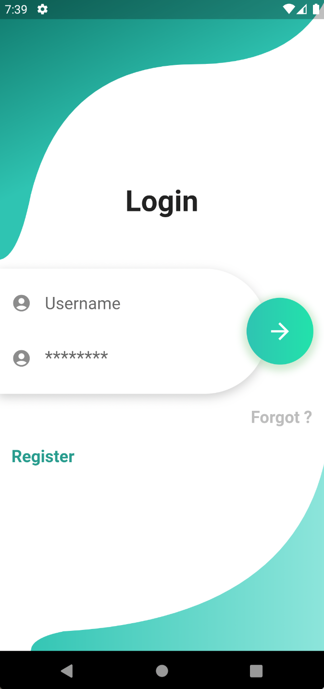
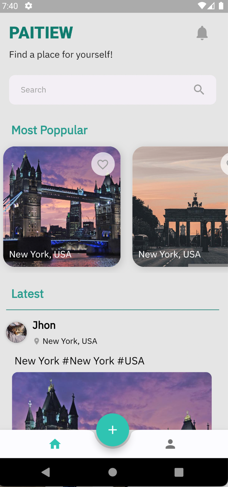
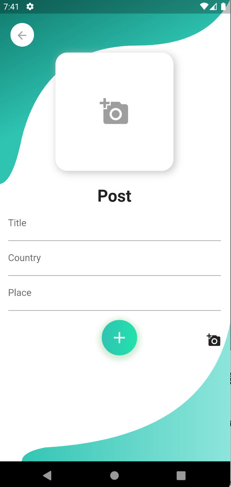
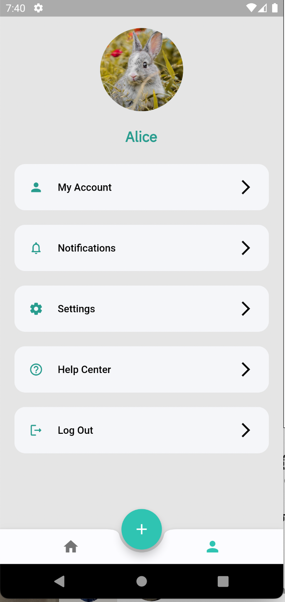

# 🚗🚗🚗 PaiTiew

Flutter representation of a Travel app UI. 

Star⭐ the repo if you like what you see😉.
## Figma Link
(https://www.figma.com/file/V42EB9yhPMFjL3rKCcfI7O/Pai-Tiew?node-id=0%3A1)


## 📸 ScreenShots


| 1 | 2|
|------|-------|
|||

| 3 | 4|
|------|-------|
|||

| 5 | 6|
|------|-------|
|||

| 7 |
|------|
||

## ✨ Requirements
* Operating System (Windows, Android, Mac Os)
* Any IDE with Flutter SDK installed (ie. IntelliJ, Android Studio, VSCode etc)
* A little knowledge of Dart and Flutter

## Getting Started

```dart
flutter run --no-sound-null-safety; 
